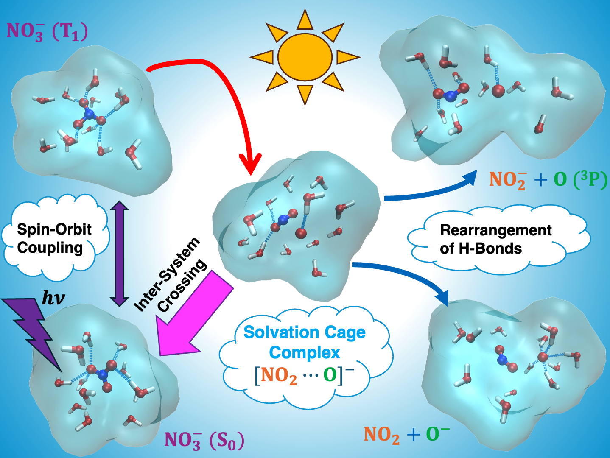

# Nitrate_Photolysis_Aqueous_Solution
Data and supplementary information of manuscript "Revealing Photochemical Pathways of Nitrate in Water through First-Principles Simulations".

This repository has the following directories:
- Gas-Phase:
    - nitrate_cam-b3lyp_scan.inp: The ORCA input file to perform a potential energy surface scan at the ground state of nitrate at the level of CAM-B3LYP.
    - guess_template.inp: The ORCA input file to generate quasi-restricted orbitals as the initial guess for multi-reference calculations.
    - sa-casscf_template.inp: The ORCA input file to perform SA-CASSCF calculations.
    - nevpt2_template.inp: The ORCA input file to perform NEVPT2 calculations.
    - mrci+q_template.inp: The ORCA input file to perform MRCI+Q calculations.
    - nitrate_revpbe0_scan.inp: The ORCA input file to perform a potential energy surface scan at the ground state of nitrate at the level of revPBE0.
    - nitrate_t1_revpbe0_template.inp: The ORCA input file to perform vertical excitations to the first triplet state of nitrate at the level of revPBE0.
